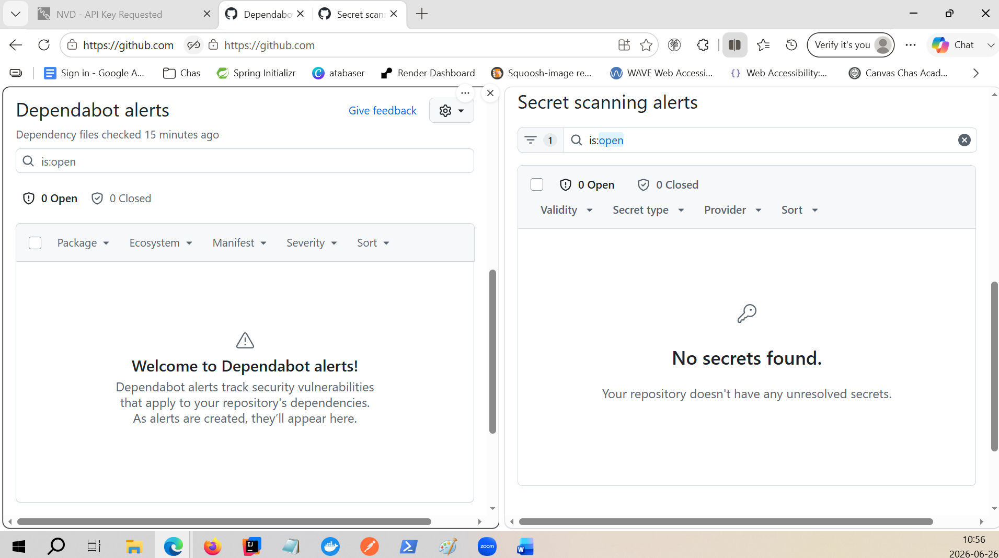
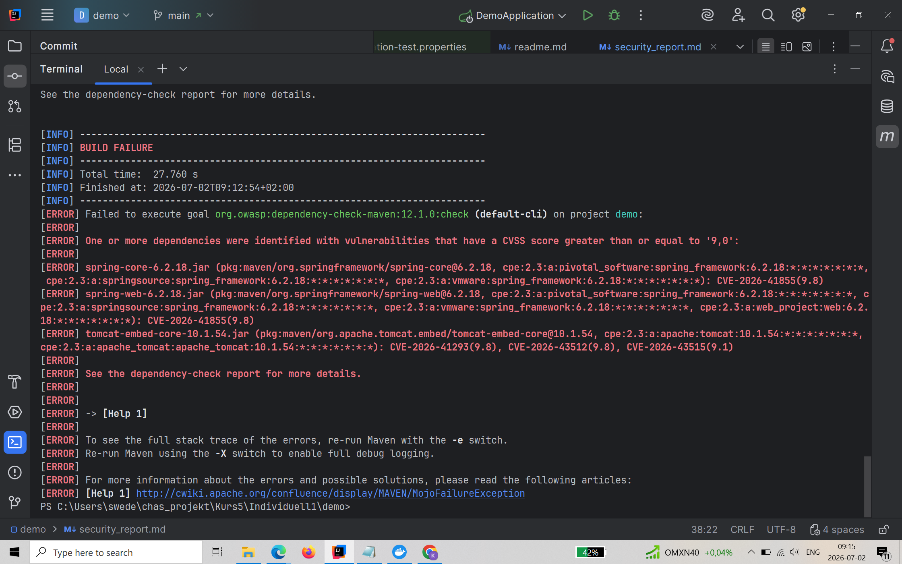
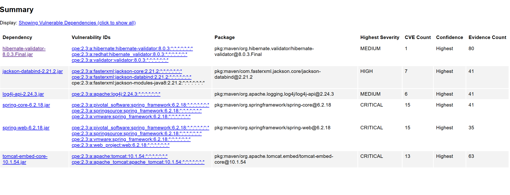
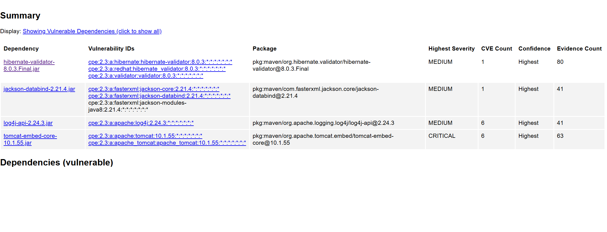
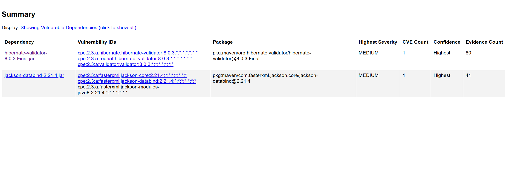
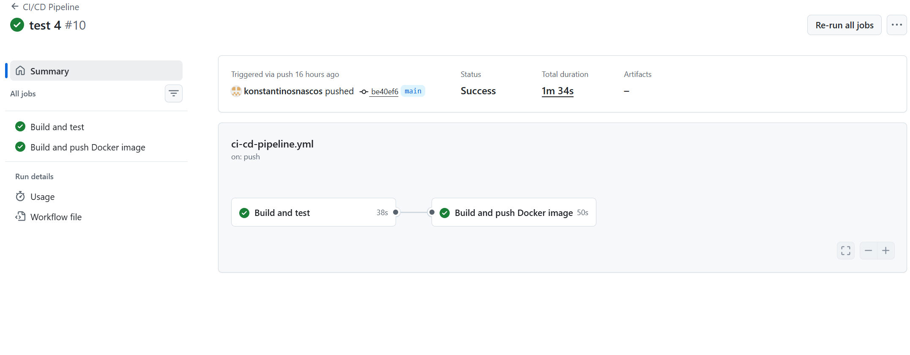

# OWASP Top 10 Säkerhetsrapport

## Fokus i analysen är tre risker:

### A06: Vulnerable and Outdated Components
### A05/A08: Security Misconfiguration
### A04: Unrestricted Resource Consumption

Målet var att identifiera säkerhetsrisker, åtgärda dom och dokumentera varför åtgärderna är viktiga.

## A06 – Vulnerable and Outdated Components
### Identifiering av problem

Först aktiverades GitHub Dependabot och Secret Scanning i mitt repository.

Dependabot hittade inga sårbarheter i projektets Maven-dependencies och Secret Scanning hittade inga exponerade API-nycklar i repot. Eftersom GitHub inte alltid hittar alla dependency-problem kompletterade jag med OWASP Dependency-Check.

Jag la till dependency-check-maven i pom.xml och körde med NVD API-nyckel:

Först misslyckades körningen på grund av filrättigheter och Sonatype OSS Index 401 Unauthorized, problemet identifierades och åtgärdades med hjälp av AI. Temp-problemet löstes genom att peka TEMP och TMP mot C:\temp. Sonatype OSS Index stängdes av i Dependency-Check eftersom NVD räcker för sig.

<ossindexAnalyzerEnabled>false</ossindexAnalyzerEnabled>

### Resultat före åtgärd

Dependency-Check hittade flera sårbara dependencies, bland annat Spring, Tomcat, Jackson och Log4j. Bygget failade eftersom vissa fynd hade CVSS över gränsen 9 som sattes i pom.xml. Detta visar att Dependabot och OWASP Dependency-Check kompletterar varandra, eftersom de använder olika metoder för att identifiera sårbarheter.

### Åtgärd

Jag uppdaterade projektets Spring Boot-parent till en nyare patchversion inom Spring Boot 3:

*senaste versioner*
<version>3.5.16</version>

Detta uppdaterade flera dependencies, bland annat Spring Framework, Jackson och Tomcat.

Därefter behövde jag uppdatera vissa dependency-versioner via Maven properties eftersom jag annars hade behövt migrera till Spring Boot 4:

<properties>
    <java.version>21</java.version>
    <tomcat.version>10.1.56</tomcat.version>
    <log4j2.version>2.25.4</log4j2.version>
</properties>

Jag uppdaterade även Bucket4j från äldre artifact till nyare JDK17-variant:

<dependency>
    <groupId>com.bucket4j</groupId>
    <artifactId>bucket4j_jdk17-core</artifactId>
    <version>8.19.0</version>
</dependency>

Efter detta var de kritiska Spring- och Tomcat-fynden åtgärdade. Log4j-fynden åtgärdades genom att uppdatera log4j2.version.

### Kvarstående vulnerabilities

Efter åtgärder återstod endast medium-fynd:

hibernate-validator-8.0.3.Final
jackson-databind-2.21.4

Jackson-fyndet är ett medium-fynd, men den rapporterade fixversionen som föreslogs gick inte att hämta från Maven Central och gav error(kan möjligtvis åtgärda innan deadline) eftersom det vid tillfället inte fanns tillgängligt via Maven central. Därför lämnades Jackson på den version som Spring Boot hanterar, och fyndet dokumenteras som medium-risk som bör följas upp vid nästa Spring Boot- eller Jackson-patch.

### Prioritering

Detta prioriterades högst och las mest tid på eftersom sårbara tredjepartsbibliotek kan ge säkerhetsproblem även om den egna koden är korrekt. Genom Dependency-Check i Maven kan projektet automatiskt faila om kritiska sårbarheter upptäcks:

<failBuildOnCVSS>9</failBuildOnCVSS>

Det gör att framtida kritiska dependency-problem inte missas manuellt. En begränsning med denna lösning är att alla versioner som satts lokalt i pom.xml måste uppdateras manuellt. Säkerhetskontrollen körs dessutom automatiskt i projektets GitHub Actions tillsammans med övriga CI/CD-steg.

## A05/A08 – Security Misconfiguration: test-endpoint i produktion
### Identifiering

Projektet innehöll en test-endpoint för att simulera HTTP 429 Too Many Requests:

@PostMapping("/test429")
public ResponseEntity<String> test429() {
return ResponseEntity
.status(HttpStatus.TOO_MANY_REQUESTS)
.body("Rate limit");
}

Denna endpoint är användbar under utveckling och test, men bör inte vara aktiv i produktion. Om test- eller debug-endpoints lämnas exponerade kan de avslöja funktionalitet eller skapa oönskat beteende.

### Åtgärd

Jag lade till Spring-profilen dev på test-controllern:

@Profile("dev")
@RestController
public class RateLimitTestController {
...
}

Det innebär att endpointen bara laddas när dev-profilen är aktiv.

I application.properties är dev-profilen avstängd som standard:

#spring.profiles.active=dev
#Avkommentera raden ovan för att aktivera test-endpoints och utvecklingskomponenter.

### Analys

Detta minskar risken för security misconfiguration eftersom utvecklingsfunktionalitet inte exponeras av misstag i normal körning. Det är en enkel men viktig åtgärd: testkod kan finnas kvar för utveckling, men den ska då vara tydligt isolerad från produktion.

## A04 – Unrestricted Resource Consumption

### Identifiering

Applikationen gör anrop till OpenAI. Det innebär två risker:

Många anrop kan skapa onödiga kostnader.
Många samtidiga eller långsamma anrop kan belasta applikationen.

Eftersom endpointen /api/ai/analyze kan trigga externa API-anrop behövdes skydd mot okontrollerad resursförbrukning. 
Detta hanterades till viss del redan i 1K5-projektet med RestClientConfig-klassen som hanterar timeouts och retry/fallback. 
Därefter har även bucket4j använts för rate-limiting som begränsar hur många anrop som kan göras per IP-adress. 
Detta är en viktig risk att hantera eftersom skenande kostnader kan vara problematiskt i alla företag oavsett hur bra en app annars fungerar. 
Med Bucket4j, timeouts och fallback blir applikationen mer motståndskraftig mot både överbelastning och externa fel.

### Analys
Denna åtgärd prioriterades eftersom applikationen använder ett externt AI-API där varje anrop innebär en kostnad. 
Utan begränsningar skulle en angripare eller ett felaktigt klientprogram kunna generera ett mycket stort antal anrop, vilket både ökar kostnaderna och riskerar att försämra tillgängligheten för andra användare. 
Kombinationen av rate limiting, timeouts och fallback ger därför flera skyddslager mot både överbelastning och ekonomiska konsekvenser. 
Detta är särskilt relevant i dagsläget när kostnaderna för användning av AI ökar.
Själva RateLimitFilter-klassen återanvändes från ett tidigare projekt och behövde därför inga kodändringar. 
Återanvändning av tidigare testad kod minskar utvecklingstiden och risken att introducera nya fel i säkerhetskritisk funktionalitet.

## Sammanfattning av genomförda åtgärder & slutsats:

I säkerhetsgranskningen identifierades tre huvudsakliga riskområden:

#### Sårbara och utdaterade dependencies.
#### Test-endpoint som riskerade att exponeras utanför utvecklingsmiljö.
#### Risk för okontrollerad resursförbrukning vid externa AI-anrop.

De mest kritiska dependency-fynden åtgärdades genom uppdatering av Spring Boot, Tomcat och Log4j. Efter dessa åtgärder återstår endast mindre vulnerabilities i olika dependecies som används.

Test-endpointen har begränsats till dev-profil och externa API-anrop skyddas med rate limiting, timeouts, retry-logik och fallback. 
Allt detta gör applikationen mer robust, minskar risken för felkonfiguration och skyddar mot onödiga kostnader eller överbelastning av systemet.

Projektet innehåller utökad säkerhet som täcker bland annat:

- OWASP Dependency-Check
- Dependabot
- GitHub Secrets
- Docker Secrets
- Bucket4j Rate Limiting
- Automatisk säkerhetskontroll i CI/CD

Säkerhetsarbetet handlar här mest om att upptäcka problem så tidigt som möjligt och automatisera kontrollerna för att minska risken att sårbarheter når produktion i ett senare stadie.

## Reflektion kring OWASP Top 10

Denna laboration utgår från de OWASP-kategorier som används i uppgiftsbeskrivningen, där exempelvis A06 – Vulnerable and Outdated Components används för att beskriva sårbara tredjepartsbibliotek. Samtidigt har OWASP publicerat en nyare Top 10-version (2025), där vissa kategorier har omstrukturerats. Till exempel återfinns beroendesäkerhet nu under A03 – Software Supply Chain Failures. Jag har utgått från vad som beskrevs i uppgiften, men jag är också medveten om att det finns senare OWASP top 10 lista att utgå från som täcker ungefär samma säkerhetspunkter med andra beskrivningar.
