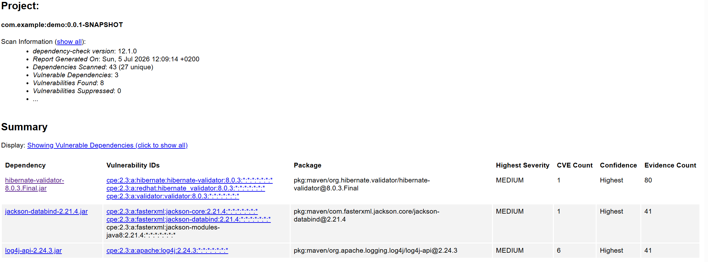

OWASP TOP 10 säkerhetsanalys

Uppgift 2k5

hitta 3 risker:
A06
dependencies med kända sårbarheter. inga varnas för i pom, dubbelkolla med en extern tjänst
snabbt, kanske inte finns problem
Slog på dependency graph, dependabot alerts/security updates

Repositoryt kollades med GitHub Dependabot och Secret Scanning. Dependabot hittade inga sårbarheter i projektets Maven-dependencies. Secret Scanning hittade inga exponerade hemligheter eller API-nycklar i repositoryt. 
Lagt till 
<groupId>org.owasp</groupId>
<artifactId>dependency-check-maven</artifactId>
i pom och kör en kontroll också just nu,

mvn dependency-check:check -DnvdApiKey=nist.api.key

A05
test-endpoint är kvar. kan lägga som dev-profil kanske
jag har kvar clientservice som inte används, kan tas bort,
snabbt

Lagt till @Profile("dev") i ratelimittestcontroller.
#spring.profiles.active=dev

A08 Security Misconfig
endast en config klass just nu, men den är väldigt simpel, hitta problem med vad den inte täcker och lägg till.

A04 unrestricted resource consumption, en del är hanterat. kolla vad som saknas och förbättra snabbt?

har lagt till bucket4j för att begränsa antal anrop man kan göra(del av lösning för A04)

$env:NVD_API_KEY="...b"
mkdir C:\temp
$env:TEMP="C:\temp"
$env:TMP="C:\temp"
./mvnw dependency-check:check

New-Item -ItemType Directory -Force C:\temp
$env:TEMP="C:\temp"
$env:TMP="C:\temp"
./mvnw dependency-check:check -DnvdApiKey=$env:NVD_API_KEY

Failed to request component-reports

Tror build fail är pga failar för många dependecy-checks och att den listar vad som måste åtgärdas.
Vissa saker kan man fixa i pom.xml tror jag, andra är jag osäker på exakt vad dom är ens.

Problem med spring-core, spring-web är borta, jackson-databind och tomcat är förbättrade med färre och mindre problem. tomcat är inget jag rört så det va uppdatering av spring versionen endast. Osäker på hur man ändrar/migrerar till spring boot 4 men kan nog styra tomcat direkt i pom.xml.

# OWASP Top 10 säkerhetsanalys

## Fokus i analysen är tre risker:

### A06: Vulnerable and Outdated Components
### A05/A08: Security Misconfiguration
### A04: Unrestricted Resource Consumption

Målet var att identifiera säkerhetsrisker, åtgärda dom och dokumentera varför åtgärderna är viktiga.

## A06 – Vulnerable and Outdated Components
### Identifiering av problem

Först aktiverades GitHub Dependabot och Secret Scanning i mitt repository.

Dependabot hittade inga sårbarheter i projektets Maven-dependencies och Secret Scanning hittade inga exponerade API-nycklar i repot. Eftersom GitHub inte alltid hittar alla dependency-problem kompletterade jag med OWASP Dependency-Check.

Jag la till dependency-check-maven i pom.xml och körde med NVD API-nyckel:

New-Item -ItemType Directory -Force C:\temp
$env:TEMP="C:\temp"
$env:TMP="C:\temp"
./mvnw dependency-check:check -DnvdApiKey=$env:NVD_API_KEY

Först misslyckades körningen på grund av filrättigheter och Sonatype OSS Index 401 Unauthorized vilket jag använde AI för att åtgärda enkelt. Temp-problemet löstes genom att peka TEMP och TMP mot C:\temp. Sonatype OSS Index stängdes av i Dependency-Check eftersom NVD räcker för sig.

<ossindexAnalyzerEnabled>false</ossindexAnalyzerEnabled>
### Resultat före åtgärd

Dependency-Check hittade flera sårbara dependencies, bland annat Spring, Tomcat, Jackson och Log4j. Bygget failade eftersom vissa fynd hade CVSS över gränsen 9 som sattes i pom.xml.

### Åtgärd

Jag uppdaterade projektets Spring Boot-parent till en nyare patchversion inom Spring Boot 3:

<version>3.5.16</version>

Detta uppdaterade flera dependencies, bland annat Spring Framework, Jackson och Tomcat.

Därefter behövde jag uppdatera vissa dependency-versioner via Maven properties eftersom jag annars hade behövt migrera till Spring Boot 4:

<properties>
    <java.version>21</java.version>
    <tomcat.version>10.1.56</tomcat.version>
    <log4j2.version>2.25.4</log4j2.version>
</properties>

Jag uppdaterade även Bucket4j från äldre artifact till nyare JDK17-variant:

<dependency>
    <groupId>com.bucket4j</groupId>
    <artifactId>bucket4j_jdk17-core</artifactId>
    <version>8.19.0</version>
</dependency>

Efter detta var de kritiska Spring- och Tomcat-fynden åtgärdade. Log4j-fynden åtgärdades genom att uppdatera log4j2.version.

### Kvarstående vulnerabilities

Efter åtgärder återstod endast medium-fynd:

hibernate-validator-8.0.3.Final
jackson-databind-2.21.4

Jackson-fyndet är ett medium-fynd, men den rapporterade fixversionen som föreslogs gick inte att hämta från Maven Central och gav error(kan möjligtvis åtgärda innan deadline). Därför lämnades Jackson på den version som Spring Boot hanterar, och fyndet dokumenteras som medium-risk som bör följas upp vid nästa Spring Boot- eller Jackson-patch.

### Prioritering

Detta prioriterades högst och las mest tid på eftersom sårbara tredjepartsbibliotek kan ge säkerhetsproblem även om den egna koden är korrekt. Genom Dependency-Check i Maven kan projektet automatiskt faila om kritiska sårbarheter upptäcks:

<failBuildOnCVSS>9</failBuildOnCVSS>

Det gör att framtida kritiska dependency-problem inte missas manuellt. Det kan vara värt att nämna att alla versioner som satts lokalt i pom.xml måste uppdateras manuellt.

## A05/A08 – Security Misconfiguration: test-endpoint i produktion
### Identifiering

Projektet innehöll en test-endpoint för att simulera HTTP 429 Too Many Requests:

@PostMapping("/test429")
public ResponseEntity<String> test429() {
return ResponseEntity
.status(HttpStatus.TOO_MANY_REQUESTS)
.body("Rate limit");
}

Denna endpoint är användbar under utveckling och test, men bör inte vara aktiv i produktion. Om test- eller debug-endpoints lämnas exponerade kan de avslöja funktionalitet eller skapa oönskat beteende.

### Åtgärd

Jag lade till Spring-profilen dev på test-controllern:

@Profile("dev")
@RestController
public class RateLimitTestController {
...
}

Det innebär att endpointen bara laddas när dev-profilen är aktiv.

I application.properties är dev-profilen avstängd som standard:

#spring.profiles.active=dev
#Avkommentera raden ovan för att aktivera test-endpoints och utvecklingskomponenter.

### Analys

Detta minskar risken för security misconfiguration eftersom utvecklingsfunktionalitet inte exponeras av misstag i normal körning. Det är en enkel men viktig åtgärd: testkod kan finnas kvar för utveckling, men den ska då vara tydligt isolerad från produktion.

